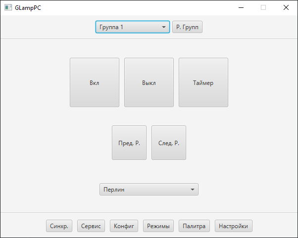

# GLampPC (WIP)

Приложения для управления GyverLamp с компьютера.

На данный момент проект развивается и находится на начальной стадии готовности.

Функционирует выбор группы, включение, выключение, таймер, смена решения и выбор привязанного сетевого адаптера.

